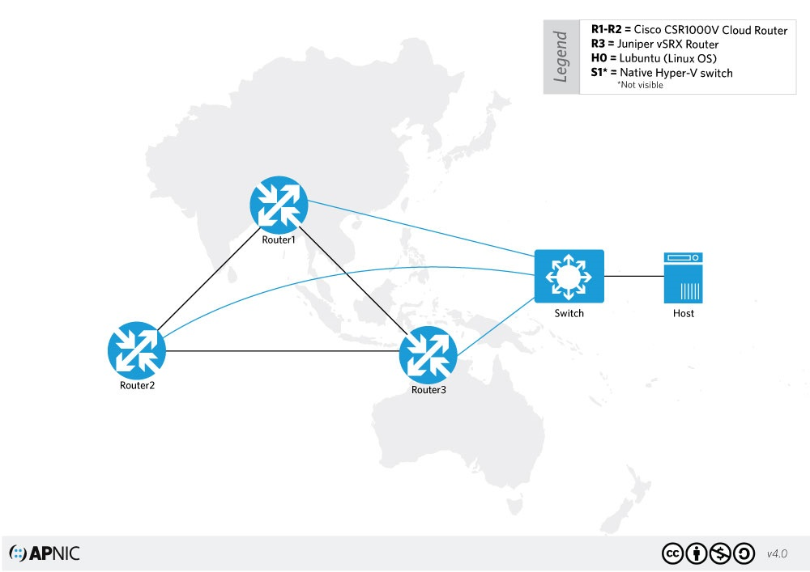

This project has been designed for you to configure various open source tools for network management and monitoring on the given topology. We will use two Cisco routers and a Linux server.

[librenms.ord](https://docs.librenms.org/) 

  

 

This project is broken-down into four parts: 

Part 1 - Simple Network Management Protocol Lab 
Part 2 - Install LibreNMS 
Part 3 - Install SmokePing 
Part 4 - Install Nagios 
Part 5 - Install Netbox 

[librenms.org](https://www.librenms.org/) 
[Machine libreNMS](https://github.com/librenms/packer-builds/releases)  | 
[Access/Credentials libreNMS machine](https://docs.librenms.org/Installation/Images/#accesscredentials) 
[How to Setup LibreNMS](https://www.youtube.com/watch?v=9R_AxJXj0AA) 

[academy.apnic.net](https://academy.apnic.net/en/virtual-labs?labId=125809)

# Part 1 - Simple Network Management Protocol Lab
 [Ubuntu SNMP youtube](https://www.youtube.com/watch?v=fIdDx1c50Dk) 
 [Documentation](https://github.com/arharif/Network-Automation/tree/main/Project%20Network%20Management%20and%20Monitoring%20SNMP%2C%20LibreNMS%20and%20RRD/Documentation) 
# Part 2 - Install LibreNMS
  [LibreNMS - Monitor all your devices easily! youtbue](https://www.youtube.com/watch?v=XYWK5Y8Sle0&t=1022s) 
  [Documentation](https://github.com/arharif/Network-Automation/tree/main/Project%20Network%20Management%20and%20Monitoring%20SNMP%2C%20LibreNMS%20and%20RRD/Documentation) 
# Part 3 - Install SmokePing
  [How to install and configure Smokeping youtube](https://www.youtube.com/watch?v=Zt5WE4xaMjc) 
  [Documentation](https://github.com/arharif/Network-Automation/tree/main/Project%20Network%20Management%20and%20Monitoring%20SNMP%2C%20LibreNMS%20and%20RRD/Documentation) 
# Part 4 - Install Nagios
  [NagiosXI Installation and Configuration in Vmware Workstation youtube](https://www.youtube.com/watch?v=R2Hi8M52dsk&t=892s) 
  [How to Install and Configure Nagios Monitoring Server on Ubuntu](https://www.youtube.com/watch?v=UMHgRnPXoEw) 
  [Documentation](https://github.com/arharif/Network-Automation/tree/main/Project%20Network%20Management%20and%20Monitoring%20SNMP%2C%20LibreNMS%20and%20RRD/Documentation) 
# Part 5 - Install Netbox
  [How to install netbox latest Version on Ubuntu 20 04 LTS || Step by Steps](https://www.youtube.com/watch?v=3MzOD-B4kjI) 
  [Documentation](https://github.com/arharif/Network-Automation/tree/main/Project%20Network%20Management%20and%20Monitoring%20SNMP%2C%20LibreNMS%20and%20RRD/Documentation).  
