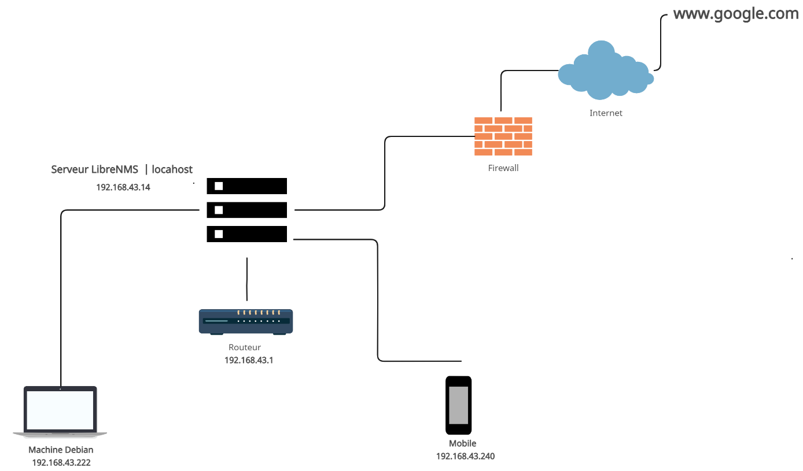

# Librenms 

# Architecture du projet

  

 

# Table des matières
 
### Sigles et abréviations 
### Introduction 
### Un peu d’histoire 
### Les débuts de LibreNMS  
### Présentation de l’outil LibreNMS  
### La valeur ajoutée de LibreNMS 
### Les principales fonctionnalités de LibreNMS  
### Architecture du projet 
### Serveur Manager LibreNMS : Installation et configuration 
- Partie 1 : Installation d’Ubuntu server 
- Partie 2 : Configuration d’Ubuntu server 
- Partie 3 : Installation de LibreNMS 
- Partie 4 : Configuration de MariaDB 
- Partie 4 : Configuration de MariaDB 
- Partie 5 : Configuration de PHP-FPM 
- Parte 6 : Configuration serveur Web 
- Parte 7 : Configuration de snmpd 
- Parte 8 : Cron job 
- Partie 9 : Interface web 
### Clients/Agents LibreNMS : Installation et configuration 
- a- D’un mobile Android 
- b- D’une machine debian 
### Conclusion 
### Références 
